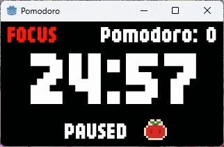

# Simple Pomodoro Timer (Godot)

## Screenshot
 

A simple Pomodoro timer made with Godot, designed for streaming and focused work sessions.

Focus time: **25 minutes**
Break time: **5 minutes**

## Features

* **Start / Pause toggle**
  * Space
  * Left Click

* **Reset + mode switch**
  * R

* **Mute toggle**
  * M

* **Quit**
  * Esc

## Download

itch.io
https://kt-9-10.itch.io/simple-pomodoro-timer-godot

## Assets

**Font**
https://hicchicc.github.io/00ff/

**BGM**
https://fai-music.com/

**Sound effects**
https://opengameart.org/content/512-sound-effects-8-bit-style

## Notes

This was a small project, but it was good practice for UI and state management in Godot.
